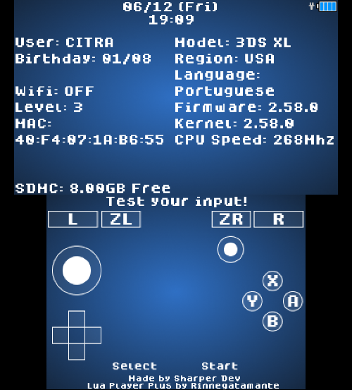
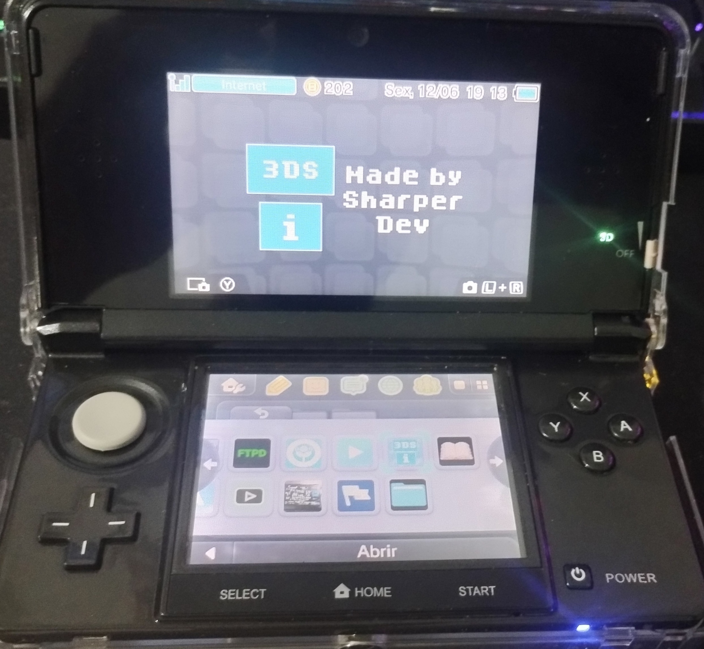
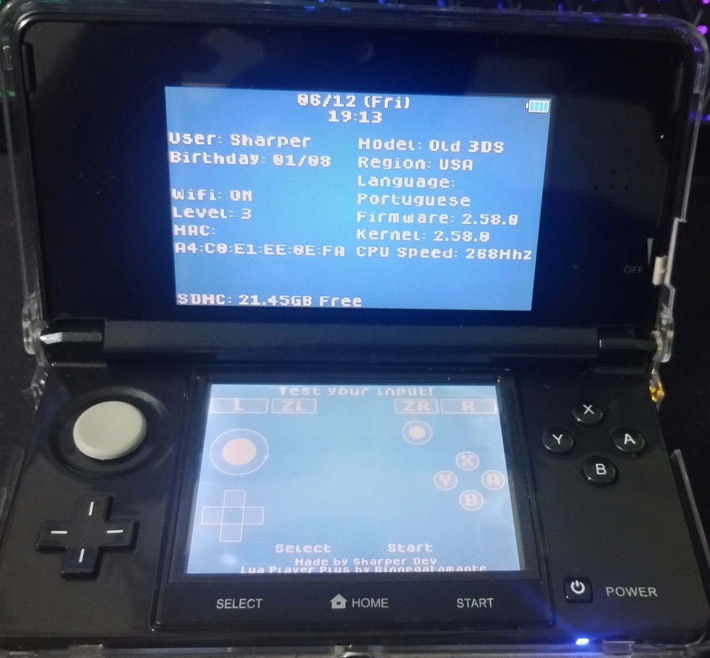

# SH 3DS Info
## Made with Lua Player Plus by Rinnegatamante

### What is it?
It is a Nintendo 3DS homebrew that shows the system info and you can test your console input, all buttons and touch.

Here is a view of the emulator:

### How it works

You install the .cia file on your 3DS using FBI and launch it from the home menu.

Then you will see the system info and can test your console input. Press home to exit.

